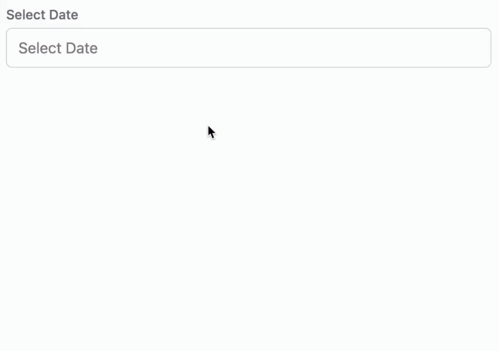

# 📅 **@reacto-kit/date-picker**

Date Picker components for React applications.
Part of the **Reacto Kit** — built with **React + Tailwind + TypeScript**. Fully themeable with Tailwind or CSS.

---

### 🎬 See it in action!



---

## 🚀 **Installation**

```bash
npm install @reacto-kit/date-picker
# or
yarn add @reacto-kit/date-picker
# or
pnpm add @reacto-kit/date-picker
```

---

## 📦 **Included Components**

| Component              | Description                                                  |
| ---------------------- | ------------------------------------------------------------ |
| 🗓️ **Calendar**       | Core calendar UI (month navigation, hover and range support) |
| 📅 **DatePicker**      | Single-date selection with an inline/dropdown calendar       |
| 🔁 **RangeDatePicker** | Two-input picker for selecting date ranges                   |

---

### ✨ **Key Features**

* Automatically injects styles — no imports required ✅
* Multi-language support (`en`, `pt`, `es`, `fr`, `jp`, `de`, `ru`)
* Hover and range selection behavior
* Built with TypeScript and Tailwind
* Fully isolated CSS namespace (`@layer reacto-kit-date-picker`)

---

## 🧱 **Quick Example**

```tsx
import { DatePicker, RangeDatePicker } from '@reacto-kit/date-picker';
import { useState } from 'react';

export const Example = () => {
  const [date, setDate] = useState<string | null>(null);
  const [range, setRange] = useState<[string | null, string | null]>([null, null]);

  return (
    <div className="p-6 flex flex-col gap-4">
      <DatePicker
        name="single"
        label="Select a date"
        placeholder="Pick a day"
        value={date}
        onChange={v => setDate(v)}
        language="en"
        period="all"
      />

      <RangeDatePicker
        name="range"
        label="Select a period"
        placeholders={['Start', 'End']}
        values={range}
        onChange={next => setRange(next)}
        language="en"
        period="all"
      />
      {/* 'range' returns [startDate, endDate] */}
    </div>
  );
};
```

---

## ⚙️ **Props**

### 🗓️ **DatePicker**

| Prop          | Type                                                   | Description                                                                        |
| ------------- | ------------------------------------------------------ | ---------------------------------------------------------------------------------- |
| `name`        | `string`                                               | Input name / identifier                                                            |
| `label`       | `string`                                               | Label text above the input                                                         |
| `placeholder` | `string`                                               | Input placeholder                                                                  |
| `value`       | `string \| null`                                       | Controlled value. String format is per `language` (or ISO). Use `null` when empty. |
| `onChange`    | `(v: string \| null) => void`                          | Callback when value changes. Receives the formatted string or `null`.              |
| `language`    | `'en' \| 'pt' \| 'es' \| 'fr' \| 'jp' \| 'de' \| 'ru'` | Locale used for UI formatting (default: `'en'`).                                   |
| `period`      | `'all' \| 'past' \| 'future' \| 'fromToday'`           | Restrict selectable dates (default: `'all'`).                                      |
| `warning`     | `string`                                               | Optional warning message shown below the input.                                    |

---

### 🔁 **RangeDatePicker**

| Prop           | Type                                               | Description                                                                         |
| -------------- | -------------------------------------------------- | ----------------------------------------------------------------------------------- |
| `name`         | `string`                                           | Component identifier                                                                |
| `label`        | `string`                                           | Label above the inputs                                                              |
| `placeholders` | `[string, string]`                                 | Placeholders for start and end inputs                                               |
| `values`       | `[string \| null, string \| null]`                 | Controlled pair `[start, end]` where each item can be a formatted string or `null`. |
| `onChange`     | `(next: [string \| null, string \| null]) => void` | Called when either start or end is updated.                                         |
| `language`     | same as DatePicker                                 | Locale for formatting and parsing                                                   |
| `period`       | same as DatePicker                                 | Date range restriction                                                              |
| `warning`      | `string`                                           | Optional warning text                                                               |

---

## 🎨 **Customization**

You can override default styles with CSS or Tailwind via class names.

### Example (Default Style)

```css
@layer reacto-kit-date-picker {
  .calendar-date.active {
    @apply bg-blue-500 text-white;
  }
}
```

### Example (Ocean Theme)

```css
.calendar-date.active {
  @apply bg-cyan-500 text-white;
}

.calendar-date.today {
  @apply border-2 border-cyan-500;
}

.calendar-date.in-range:not(.inverted) {
  @apply bg-cyan-100 text-cyan-700;
}
```

> 💡 Tip: Customize colors, hover states, or range styles by redefining only the classes you want to change. Styles are injected automatically — no manual imports needed.

---

## 🗂️ **Component Classes Reference**

| Component / Element | Base Class               | Variants / States                                                               | Description / Usage                                                                                                                                                                                                                |
| ------------------- | ------------------------ | ------------------------------------------------------------------------------- | ---------------------------------------------------------------------------------------------------------------------------------------------------------------------------------------------------------------------------------- |
| Calendar container  | `calendar`               | —                                                                               | Main wrapper for the calendar. Applies layout, padding, shadow, background, and rounded corners.                                                                                                                                   |
| Month Arrow button  | `calendar-arrow`         | `able`, `disabled`                                                              | Buttons to navigate between months. `able` when navigation is allowed, `disabled` otherwise.                                                                                                                                       |
| Current Month label | `calendar-current-month` | —                                                                               | Displays the current month and year at the top of the calendar.                                                                                                                                                                    |
| Weekday label       | `calendar-weekday`       | —                                                                               | Labels for weekdays (Mon, Tue, …) in the calendar header.                                                                                                                                                                          |
| Date button         | `calendar-date`          | `able`, `disabled`, `today`, `active`, `in-range`, `hover-in-range`, `inverted` | Each day cell in the calendar. Variants: `today` highlights current day, `active` for selected dates, `in-range` for dates between a range, `hover-in-range` when hovering a range, `inverted` if the range selection is backward. |
| Input Label         | `input-label`            | `value`, `empty`                                                                | Label above the input field. Variant `value` applies when input has content, `empty` when it's empty.                                                                                                                              |
| Picker Input        | `picker-input`           | `warning`, `focus`                                                              | Input field that opens the calendar. `warning` when validation fails, `focus` when focused.                                                                                                                                        |
| Warning Message     | `warning-message`        | —                                                                               | Text below the input showing validation or error messages.                                                                                                                                                                         |

💡 **Notes from the code:**

* `clsx` dynamically applies variants based on state (`active`, `warning`, etc.).
* Calendar arrows are enabled or disabled based on the `period` prop and current month.
* Date buttons reflect multiple states, including range selection and hover.
* Input label adapts styling depending on whether the input has a value.

---

## 🌐 **Compatibility**

Works seamlessly with React 17+, Next.js 12+, and any project using Tailwind CSS 3+.

---

## 💻 **Local Development**

Clone the repository and run (from monorepo root):

```bash
pnpm install
pnpm dev
```

Open **Storybook** to preview components:

```bash
pnpm storybook
```

Or directly inside the package:

```bash
cd packages/date-picker
pnpm dev
```

---

## 🏗️ **Build**

```bash
cd packages/date-picker
pnpm build
```

Build output goes to `/dist`.
